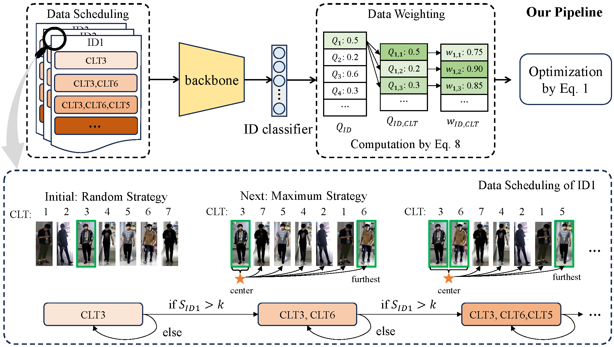

## [Unleashing the Potential of Traditional Person Re-ID Methods to Clothes Changed Scenario via Curriculum Learning 🔗](https://doi.org/10.1016/j.patcog.2026.113509)

### Pipeline



### Installation

```
conda create -n ccreid python=3.8

conda activate clipreid

conda install pytorch==1.8.0 torchvision==0.9.0 torchaudio==0.8.0 cudatoolkit=10.2 -c pytorch

pip install yacs

pip install timm

pip install scikit-image

pip install tqdm

pip install ftfy

pip install regex
```

### Prepare Dataset

Download the datasets ([PRCC](https://www.isee-ai.cn/~yangqize/clothing.html), [LTCC](https://naiq.github.io/LTCC_Perosn_ReID.html), [VC-Clothes](https://wanfb.github.io/dataset), [DeepChange](https://github.com/PengBoXiangShang/deepchange), [LaST](https://sites.google.com/view/personreid)), and then unzip them to `your_dataset_dir`.

### Training

Running ViT-based CLIP-ReID for LTCC, you need to modify the bottom of configs/person/vit_clipreid.yml to

```
DATASETS:

   NAMES: ('ltcc')

   ROOT_DIR: ('your_dataset_dir')

OUTPUT_DIR: 'your_output_dir'
```

then run

```
CUDA_VISIBLE_DEVICES=0 python train_clipreid.py --config_file configs/person/vit_clipreid.yml
```

### Evaluation

For example, if you want to test ViT-based CLIP-ReID for LTCC

```
CUDA_VISIBLE_DEVICES=0 python test_clipreid.py --config_file configs/person/vit_clipreid.yml TEST.WEIGHT 'your_trained_checkpoints_path/ViT-B-16_best.pth'
```

### Acknowledgement

Codebase from [CLIP-ReID](https://github.com/Syliz517/CLIP-ReID).

### Citation

If you use this code for your research, please cite

```
@Article{xiao2026113509,
  author  = {Yuxuan Xiao and Shanshan Zhang and Jian Yang},
  journal = {Pattern Recognition},
  title   = {Unleashing the Potential of Traditional Person Re-ID Methods to Clothes Changed Scenario via Curriculum Learning},
  year    = {2026},
  issn    = {0031-3203},
  pages   = {113509},
  doi     = {https://doi.org/10.1016/j.patcog.2026.113509},
}
```
